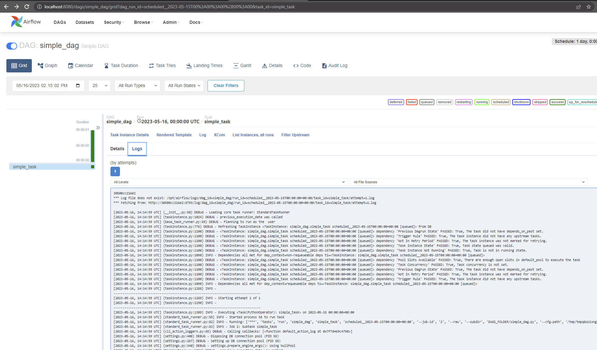
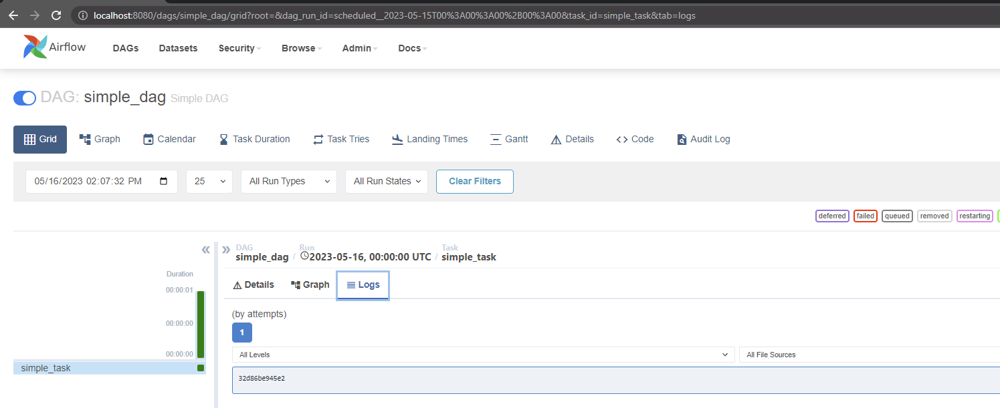

# Airflow 2.6.0 Celery-Docker Logging Bug

Can't see logs in the Airflow 2.6.0 Webserver page when using Celery executor & Docker Swarm.  When viewing the logs,
only the Worker's Docker container ID is displayed for some reason.  The Log file is present on the Worker, but is 
not downloaded or displayed properly by the Webserver.

Webserver authentication - 
Username: admin
Password: admin

## 2.5.3
```shell
$ make start_2_5_3
AIRFLOW_VERSION="2.5.3-python3.10" docker stack deploy airflow --compose-file docker-compose.yml
Creating network airflow_net
Creating service airflow_redis
Creating service airflow_webserver
Creating service airflow_scheduler
Creating service airflow_worker
Creating service airflow_postgres

$ docker service ls
ID             NAME                MODE         REPLICAS   IMAGE                             PORTS
i6y4p3t0o3t5   airflow_postgres    replicated   1/1        postgres:alpine                   *:5432->5432/tcp
t8d6569fuesm   airflow_redis       replicated   1/1        redis:alpine                      *:6379->6379/tcp
zbgbvtaiad0s   airflow_scheduler   replicated   1/1        apache/airflow:2.5.3-python3.10
psd9w93lphf6   airflow_webserver   replicated   1/1        apache/airflow:2.5.3-python3.10   *:8080->8080/tcp
mfkv2socf5kg   airflow_worker      replicated   1/1        apache/airflow:2.5.3-python3.10

$ docker ps
CONTAINER ID   IMAGE                             COMMAND                  CREATED              STATUS                        PORTS      NAMES
6d8b174ea368   postgres:alpine                   "docker-entrypoint.s…"   About a minute ago   Up About a minute (healthy)   5432/tcp   airflow_postgres.1.ma9iyuv5f55br7mjqpdb91pqt
30500cc216e2   apache/airflow:2.5.3-python3.10   "/usr/bin/dumb-init …"   About a minute ago   Up About a minute             8080/tcp   airflow_worker.1.yv7hxyi1ixakmrplmzl1u6q02
ea7b60b4cea6   apache/airflow:2.5.3-python3.10   "/usr/bin/dumb-init …"   About a minute ago   Up About a minute (healthy)   8080/tcp   airflow_scheduler.1.z8b6cez0fvmqvtw4j4zpm4660
4aa8a4fdb39b   redis:alpine                      "docker-entrypoint.s…"   About a minute ago   Up About a minute (healthy)   6379/tcp   airflow_redis.1.0kkzlqxgnivqhxmaxu785krms
6a3eaa8ae57e   apache/airflow:2.5.3-python3.10   "/usr/bin/dumb-init …"   About a minute ago   Up About a minute (healthy)   8080/tcp   airflow_webserver.1.ec6fva646pxvi4ktosqc8doeo
```

Navigating to the log for the task instance run:
http://localhost:8080/dags/simple_dag/grid?dag_run_id=scheduled__2023-05-15T00%3A00%3A00%2B00%3A00&task_id=simple_task



I see the following in the Webserver logs:
```log
[2023-05-16 14:17:07,952] {_client.py:1022} DEBUG - HTTP Request: GET http://30500cc216e2:8793/log/dag_id=simple_dag/run_id=scheduled__2023-05-15T00:00:00+00:00/task_id=simple_task/attempt=1.log "HTTP/1.1 200 OK"
2023-05-16T14:17:07.953586947Z 10.0.0.2 - - [16/May/2023:14:17:07 +0000] "GET /get_logs_with_metadata?dag_id=simple_dag&task_id=simple_task&execution_date=2023-05-15T00%3A00%3A00%2B00%3A00&map_index=-1&format=file&try_number=1 HTTP/1.1" 200 7604 "http://localhost:8080/dags/simple_dag/grid?dag_run_id=scheduled__2023-05-15T00%3A00%3A00%2B00%3A00&task_id=simple_task" "Mozilla/5.0 (Windows NT 10.0; Win64; x64) AppleWebKit/537.36 (KHTML, like Gecko) Chrome/113.0.0.0 Safari/537.36"
```

The Task instance logs on the Webserver show:
```log
30500cc216e2
*** Log file does not exist: /opt/airflow/logs/dag_id=simple_dag/run_id=scheduled__2023-05-15T00:00:00+00:00/task_id=simple_task/attempt=1.log
*** Fetching from: http://30500cc216e2:8793/log/dag_id=simple_dag/run_id=scheduled__2023-05-15T00:00:00+00:00/task_id=simple_task/attempt=1.log

[2023-05-16, 14:14:59 UTC] {__init__.py:50} DEBUG - Loading core task runner: StandardTaskRunner
[2023-05-16, 14:14:59 UTC] {taskinstance.py:1024} DEBUG - previous_execution_date was called
[2023-05-16, 14:14:59 UTC] {base_task_runner.py:69} DEBUG - Planning to run as the  user
[2023-05-16, 14:14:59 UTC] {taskinstance.py:776} DEBUG - Refreshing TaskInstance <TaskInstance: simple_dag.simple_task scheduled__2023-05-15T00:00:00+00:00 [queued]> from DB
[2023-05-16, 14:14:59 UTC] {taskinstance.py:1100} DEBUG - <TaskInstance: simple_dag.simple_task scheduled__2023-05-15T00:00:00+00:00 [queued]> dependency 'Previous Dagrun State' PASSED: True, The task did not have depends_on_past set.
[2023-05-16, 14:14:59 UTC] {taskinstance.py:1100} DEBUG - <TaskInstance: simple_dag.simple_task scheduled__2023-05-15T00:00:00+00:00 [queued]> dependency 'Trigger Rule' PASSED: True, The task instance did not have any upstream tasks.
[2023-05-16, 14:14:59 UTC] {taskinstance.py:1100} DEBUG - <TaskInstance: simple_dag.simple_task scheduled__2023-05-15T00:00:00+00:00 [queued]> dependency 'Not In Retry Period' PASSED: True, The task instance was not marked for retrying.
[2023-05-16, 14:14:59 UTC] {taskinstance.py:1100} DEBUG - <TaskInstance: simple_dag.simple_task scheduled__2023-05-15T00:00:00+00:00 [queued]> dependency 'Task Instance State' PASSED: True, Task state queued was valid.
[2023-05-16, 14:14:59 UTC] {taskinstance.py:1100} DEBUG - <TaskInstance: simple_dag.simple_task scheduled__2023-05-15T00:00:00+00:00 [queued]> dependency 'Task Instance Not Running' PASSED: True, Task is not in running state.
[2023-05-16, 14:14:59 UTC] {taskinstance.py:1090} INFO - Dependencies all met for dep_context=non-requeueable deps ti=<TaskInstance: simple_dag.simple_task scheduled__2023-05-15T00:00:00+00:00 [queued]>
[2023-05-16, 14:14:59 UTC] {taskinstance.py:1100} DEBUG - <TaskInstance: simple_dag.simple_task scheduled__2023-05-15T00:00:00+00:00 [queued]> dependency 'Pool Slots Available' PASSED: True, There are enough open slots in default_pool to execute the task
[2023-05-16, 14:14:59 UTC] {taskinstance.py:1100} DEBUG - <TaskInstance: simple_dag.simple_task scheduled__2023-05-15T00:00:00+00:00 [queued]> dependency 'Task Concurrency' PASSED: True, Task concurrency is not set.
[2023-05-16, 14:14:59 UTC] {taskinstance.py:1100} DEBUG - <TaskInstance: simple_dag.simple_task scheduled__2023-05-15T00:00:00+00:00 [queued]> dependency 'Previous Dagrun State' PASSED: True, The task did not have depends_on_past set.
[2023-05-16, 14:14:59 UTC] {taskinstance.py:1100} DEBUG - <TaskInstance: simple_dag.simple_task scheduled__2023-05-15T00:00:00+00:00 [queued]> dependency 'Not In Retry Period' PASSED: True, The task instance was not marked for retrying.
[2023-05-16, 14:14:59 UTC] {taskinstance.py:1100} DEBUG - <TaskInstance: simple_dag.simple_task scheduled__2023-05-15T00:00:00+00:00 [queued]> dependency 'Trigger Rule' PASSED: True, The task instance did not have any upstream tasks.
[2023-05-16, 14:14:59 UTC] {taskinstance.py:1090} INFO - Dependencies all met for dep_context=requeueable deps ti=<TaskInstance: simple_dag.simple_task scheduled__2023-05-15T00:00:00+00:00 [queued]>
[2023-05-16, 14:14:59 UTC] {taskinstance.py:1288} INFO - 
--------------------------------------------------------------------------------
[2023-05-16, 14:14:59 UTC] {taskinstance.py:1289} INFO - Starting attempt 1 of 1
[2023-05-16, 14:14:59 UTC] {taskinstance.py:1290} INFO - 
--------------------------------------------------------------------------------
[2023-05-16, 14:14:59 UTC] {taskinstance.py:1309} INFO - Executing <Task(PythonOperator): simple_task> on 2023-05-15 00:00:00+00:00
[2023-05-16, 14:14:59 UTC] {standard_task_runner.py:55} INFO - Started process 58 to run task
[2023-05-16, 14:14:59 UTC] {standard_task_runner.py:82} INFO - Running: ['***', 'tasks', 'run', 'simple_dag', 'simple_task', 'scheduled__2023-05-15T00:00:00+00:00', '--job-id', '2', '--raw', '--subdir', 'DAGS_FOLDER/simple_dag.py', '--cfg-path', '/tmp/tmpq8ooixng']
[2023-05-16, 14:14:59 UTC] {standard_task_runner.py:83} INFO - Job 2: Subtask simple_task
[2023-05-16, 14:14:59 UTC] {cli_action_loggers.py:65} DEBUG - Calling callbacks: [<function default_action_log at 0x7f7d469c4790>]
[2023-05-16, 14:14:59 UTC] {settings.py:408} DEBUG - Disposing DB connection pool (PID 58)
[2023-05-16, 14:14:59 UTC] {settings.py:267} DEBUG - Setting up DB connection pool (PID 58)
[2023-05-16, 14:14:59 UTC] {settings.py:340} DEBUG - settings.prepare_engine_args(): Using NullPool
[2023-05-16, 14:14:59 UTC] {taskinstance.py:1024} DEBUG - previous_execution_date was called
[2023-05-16, 14:14:59 UTC] {task_command.py:389} INFO - Running <TaskInstance: simple_dag.simple_task scheduled__2023-05-15T00:00:00+00:00 [running]> on host 30500cc216e2
[2023-05-16, 14:14:59 UTC] {taskinstance.py:776} DEBUG - Refreshing TaskInstance <TaskInstance: simple_dag.simple_task scheduled__2023-05-15T00:00:00+00:00 [running]> from DB
[2023-05-16, 14:14:59 UTC] {taskinstance.py:1024} DEBUG - previous_execution_date was called
[2023-05-16, 14:14:59 UTC] {taskinstance.py:855} DEBUG - Clearing XCom data
[2023-05-16, 14:15:00 UTC] {retries.py:80} DEBUG - Running RenderedTaskInstanceFields._do_delete_old_records with retries. Try 1 of 3
[2023-05-16, 14:15:00 UTC] {taskinstance.py:1516} INFO - Exporting the following env vars:
AIRFLOW_CTX_DAG_OWNER=***
AIRFLOW_CTX_DAG_ID=simple_dag
AIRFLOW_CTX_TASK_ID=simple_task
AIRFLOW_CTX_EXECUTION_DATE=2023-05-15T00:00:00+00:00
AIRFLOW_CTX_TRY_NUMBER=1
AIRFLOW_CTX_DAG_RUN_ID=scheduled__2023-05-15T00:00:00+00:00
[2023-05-16, 14:15:00 UTC] {__init__.py:117} DEBUG - Preparing lineage inlets and outlets
[2023-05-16, 14:15:00 UTC] {__init__.py:155} DEBUG - inlets: [], outlets: []
[2023-05-16, 14:15:00 UTC] {simple_dag.py:16} INFO - foo
[2023-05-16, 14:15:00 UTC] {python.py:177} INFO - Done. Returned value was: None
[2023-05-16, 14:15:00 UTC] {__init__.py:75} DEBUG - Lineage called with inlets: [], outlets: []
[2023-05-16, 14:15:00 UTC] {taskinstance.py:776} DEBUG - Refreshing TaskInstance <TaskInstance: simple_dag.simple_task scheduled__2023-05-15T00:00:00+00:00 [running]> from DB
[2023-05-16, 14:15:00 UTC] {taskinstance.py:1338} DEBUG - Clearing next_method and next_kwargs.
[2023-05-16, 14:15:00 UTC] {taskinstance.py:1327} INFO - Marking task as SUCCESS. dag_id=simple_dag, task_id=simple_task, execution_date=20230515T000000, start_date=20230516T141459, end_date=20230516T141500
[2023-05-16, 14:15:00 UTC] {taskinstance.py:2249} DEBUG - Task Duration set to 0.109387
[2023-05-16, 14:15:00 UTC] {cli_action_loggers.py:83} DEBUG - Calling callbacks: []
[2023-05-16, 14:15:00 UTC] {local_task_job.py:212} INFO - Task exited with return code 0
[2023-05-16, 14:15:00 UTC] {dagrun.py:688} DEBUG - number of tis tasks for <DagRun simple_dag @ 2023-05-15 00:00:00+00:00: scheduled__2023-05-15T00:00:00+00:00, state:running, queued_at: 2023-05-16 14:14:59.581244+00:00. externally triggered: False>: 0 task(s)
[2023-05-16, 14:15:00 UTC] {taskinstance.py:2596} INFO - 0 downstream tasks scheduled from follow-on schedule check
```

## 2.6.0
```shell
$ make start_2_6_0

$ docker service ls
ID             NAME                MODE         REPLICAS   IMAGE                             PORTS
lh5ztps50jhl   airflow_postgres    replicated   1/1        postgres:alpine                   *:5432->5432/tcp
lyc6ty5wmjwj   airflow_redis       replicated   1/1        redis:alpine                      *:6379->6379/tcp
wn2wfw3tq6hj   airflow_scheduler   replicated   1/1        apache/airflow:2.6.0-python3.10
9309sdj10hwm   airflow_webserver   replicated   1/1        apache/airflow:2.6.0-python3.10   *:8080->8080/tcp
zpi3dptsmlj0   airflow_worker      replicated   1/1        apache/airflow:2.6.0-python3.10

$ docker ps
CONTAINER ID   IMAGE                             COMMAND                  CREATED         STATUS                   PORTS      NAMES
d1f860017cba   apache/airflow:2.6.0-python3.10   "/usr/bin/dumb-init …"   3 minutes ago   Up 3 minutes (healthy)   8080/tcp   airflow_scheduler.1.bwqv51zaj7glkfb1s55xhstz2
32d86be945e2   apache/airflow:2.6.0-python3.10   "/usr/bin/dumb-init …"   3 minutes ago   Up 3 minutes             8080/tcp   airflow_worker.1.myux31tenf27br4t1x0oqbnb3
4ca4b2e0b3ba   apache/airflow:2.6.0-python3.10   "/usr/bin/dumb-init …"   3 minutes ago   Up 3 minutes (healthy)   8080/tcp   airflow_webserver.1.9qo5hb1jpblas2syojral7gjx
fd0b08a66c3e   redis:alpine                      "docker-entrypoint.s…"   3 minutes ago   Up 3 minutes (healthy)   6379/tcp   airflow_redis.1.p518g46rhvh5p5rx75rk71tkd
3eb7a4c94612   postgres:alpine                   "docker-entrypoint.s…"   3 minutes ago   Up 3 minutes (healthy)   5432/tcp   airflow_postgres.1.wu7vi8zfg7hhimp3maebur8ht
```

Viewing the logs of a single task run:
http://localhost:8080/dags/simple_dag/grid?dag_run_id=scheduled__2023-05-15T00%3A00%3A00%2B00%3A00&task_id=simple_task&tab=logs




The log here is displaying the Container ID for some reason.

```log
32d86be945e2
```

For reference, back in the list of running containers:
```shell
CONTAINER ID   IMAGE                             COMMAND                  CREATED         STATUS                   PORTS      NAMES
32d86be945e2   apache/airflow:2.6.0-python3.10   "/usr/bin/dumb-init …"   3 minutes ago   Up 3 minutes             8080/tcp   airflow_worker.1.myux31tenf27br4t1x0oqbnb3
```
